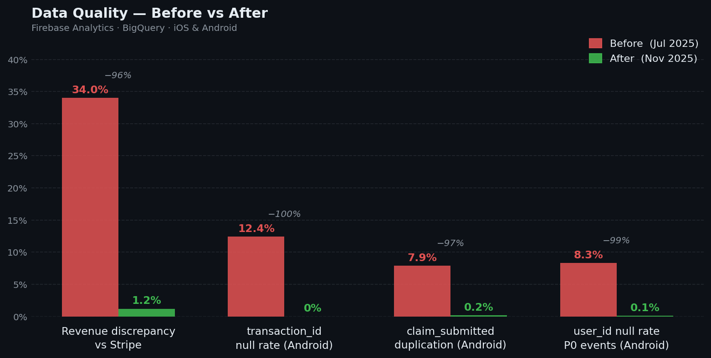

# Mobile Analytics Reliability Framework

Finance flagged a 34% gap between our analytics and Stripe. The DPO found we'd been tracking users before consent. Product had been optimizing a funnel built on duplicated events for 8 months.
Nobody knew. The data looked fine in the dashboard.

---

## The Problem

A high-volume mobile app (iOS + Android) running Firebase Analytics + BigQuery had accumulated six compounding tracking failures:

- **Duplicate conversions** — `claim_submitted` duplicated at 7.9% on Android (button tap instead of API callback)
- **Missing revenue keys** — `transaction_id` null on 12.4% of Android payments, making Stripe reconciliation impossible
- **Broken funnels** — `purchase_initiated` and `document_uploaded` not implemented on Android at all
- **Platform divergence** — 9 events with iOS/Android naming or trigger discrepancies; CRM attribution broken for 6+ months
- **GDPR violations** — 4 event types firing before Firebase consent state was initialized; 340k+ pre-consent `first_open` events in BigQuery
- **Naming chaos** — 17 events non-compliant with taxonomy; `notif_clicked` vs `notification_opened` split CRM audiences

Finance had flagged a persistent gap between analytics and Stripe but couldn't explain it. Product was making roadmap decisions on an inflated Android conversion baseline. The DPO had never reviewed the Firebase consent implementation.

---

## What Was Built

**1. Full audit** — DebugView sessions, BigQuery structural analysis, and stakeholder interviews across Product, Engineering, Finance, CRM, and Legal. Every issue logged with platform, severity, owner, and root cause.

**2. Standardized taxonomy** — Approved event list (38 events), parameter dictionary with enums and types, strict naming convention enforced in review and CI. Deprecated events tracked with migration paths.

**3. Measurement plan** — YAML event definitions for all P0/P1 events with trigger logic, required parameters, platform-specific implementation, and QA rules. Engineers now implement from spec, not from informal tickets.

**4. BigQuery validation suite** — Five production queries running daily: null rate monitoring, duplicate detection, naming compliance, platform parity, and event sequence integrity. Results feed a Slack alert channel and Looker Studio dashboard.

**5. Anomaly detection** — Rolling 7-day average + standard deviation per event and platform. Fires WARNING at z > 2, CRITICAL at z > 3. Distinguishes drops from spikes, classifies by event priority (P0/P1/P2).

**6. GDPR remediation** — Firebase initialized with deny-all defaults before SDK configuration. Commanders Act CMP callback wired to `setConsent()`. Consent audit trail in BigQuery. 4 pre-consent violations eliminated.

---

## Results



| Area | Before | After |
|---|---|---|
| Revenue discrepancy (BigQuery vs Stripe) | **34%** | **1.2%** |
| Monthly revenue undercount | **€41,200** | **€1,480** |
| `transaction_id` null rate on `payment_completed` | **12.4%** | **0.0%** |
| `claim_submitted` duplication rate (Android) | **7.9%** | **0.2%** |
| `user_id` null rate on P0 post-auth events | **8.3%** | **0.1%** |
| Cross-platform event parity (P0/P1 events) | **63%** | **96%** |
| Pre-consent tracking violations | **4 event types** | **0** |
| Data engineer time on incident investigation | **~40% of week** | **~8% of week** |
| Analytics incident resolution time | **3–5 days** | **< 4 hours** |
| Finance escalations due to data discrepancy | **3 in Q3** | **0 in Q4** |

---

## Stack

Firebase Analytics · BigQuery (event-level, UNNEST, scheduled queries) · Commanders Act (TMS + CMP, TCF 2.2) · Looker Studio · dbt · iOS (Swift) · Android (Kotlin)

---

## Repository

```
audit/event_audit_log.csv               26 issues catalogued — event, platform, severity, fix version
taxonomy/approved_event_list.csv        38 standardized events with trigger, owner, platform
taxonomy/parameter_dictionary.md        All parameters, types, enums, GDPR flags
measurement_plan/claim_submitted.yaml   P0 event spec — trigger logic, params, QA rules, code
measurement_plan/payment_completed.yaml P0 event spec — revenue-critical, Stripe reconciliation
sql/funnel_claim_submission.sql         Claim funnel with deduplication, alert flags, time distribution
sql/anomaly_detection_rolling.sql       Rolling z-score anomaly detection across all P0/P1 events
sql/validation_suite.sql                5 daily checks — nulls, duplicates, naming, parity, sequence
data_quality_framework/validation_rules.md  Full rule catalog — thresholds, severity, failure history
privacy_consent/gdpr_compliance.md      Consent implementation + audit findings + BigQuery checks
impact/results.md                       Full before/after metrics across 6 dimensions
```
